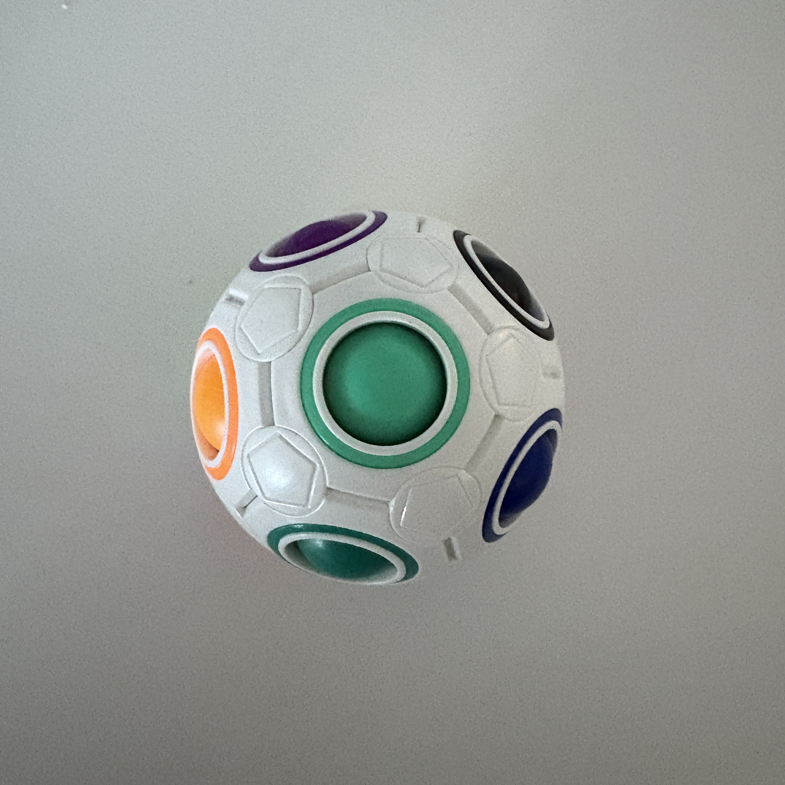
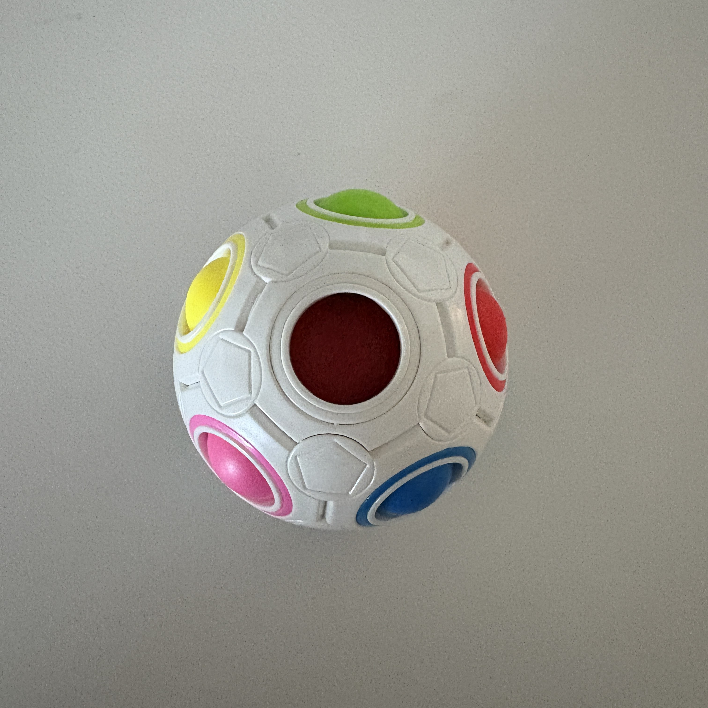

## Puzzle Ball Solver
#### Created by Nick Pranske

This is a project that started several years ago when I was in college. I saw someone with this fidget toy ball and so I bought one of my own. The toy consists of a plastic outer shell, a foam core, and colored balls that each correlate to a round slot of the same color around the outer shell. There are 12 slots and 11 balls, meaning you can move 1 ball at a time in order to match the balls to the corresponding slot. Think of it as a dodecahedral slide puzzle. 

   
  <em>Top-View</em>

   
  <em>Bottom-View</em>

Shortly after buying it, I began the quest to figure out how to write a program to solve it for me. Seeing as I had no idea how to do that, I took it step-by-step

### Step 1: Recreate the game digitally
In order to understand how it works, I had to recreate the game on the computer. I started by figuring out what data structure could represent this toy. Luckily, thinking of it as a dodecahedron instead of a sphere made it much easier to conceptualize. I eventually figured out that if I told the program which other slots each one was surrounded by, it would make a structure that only has one possible configuration. So, the "adjacency map" was born:

        adjacency_map = {
            0: [1,5,6,8,11],    black: dark_blue, pink, purple, teal, yellow
            1: [0,2,5,8,9],     dark_blue: black, light_blue, pink, teal, turquoise
            2: [1,5,7,9,10],    light_blue: dark_blue, pink, red, turquoise, white
            3: [4,6,7,10,11],   light_green: orange, purple, red, white, yellow
            4: [3,6,7,8,9],     orange: light_green, purple, red, teal, turquoise
            5: [0,1,2,10,11],   pink: black, dark_blue, light_blue, white, yellow
            6: [0,3,4,8,11],    purple: black, light_green, orange, teal, yellow
            7: [2,3,4,9,10],    red: light_blue, light_green, orange, turquoise, white
            8: [0,1,4,6,9],     teal: black, dark_blue, orange, purple, turquoise
            9: [1,2,4,7,8],     turquoise: dark_blue, light_blue, orange, red, teal
            10: [2,3,5,7,11],   white: light_blue, light_green, pink, red, yellow
            11: [0,3,5,6,10]    yellow: black, light_green, pink, purple, white
        }

From there, I made a method by which the user can input the initial state of the puzzle into the command line, then the program prompts the user to move a ball. On the backend, it's as simple as updating the "initial state" each time the player makes a move and constantly checking if the current state matches the desired state. This project can be found in "manual_puzzle_ball.py" and is playable (albeit frustrating to keep track of when you don't own a puzzle ball).

### Step 2: Solve it algorithmically
Once I had the data structures and the gameplay working correctly, the next step was to figure out how to solve it. I first tried Machine Learning techniques like reinforcement learning, but after unsuccessful trial runs I realized I was overcomplicating it. At the end of the day, it's no more than a "shortest path" problem. So, I found the A* Search algorithm to be the best suited. A* works well as long as you know your initial state and desired end state. Something like reinforcement learning would be better in a situation where the end state is unknown or less known.

A* uses heuristics such as nearest neighbors and euclidean distance to find the shortest path from initial state to desired state. So after a few tweaks to the heuristics, I found the algorithm works remarkably well. This can be found in "a_star_solve_puzzle.py".

The only problem now was the method of inputting the initial state. It is tedious to type each color into the command line.

### Step 3: Building a GUI
I had recently started experimented with Streamlit as a GUI and I have loved it so far. So, I asked Copilot to make me a Streamlit site where the user could select each color from a dropdown and click solve. Gen AI did not disappoint - I changed a few things but the website was pretty much plug-and-play. It can be found [HERE](https://puzzle-ball-solver.streamlit.app/).

### Step 4: Next steps
The next update I'm working on is a way to use Computer Vision via OpenCV to upload pictures of the physical ball and automatically detect the current state. I may make some changes to the existing GUI too, maybe adding more of a matching/drag-and-drop aspect to it.

                                                                    